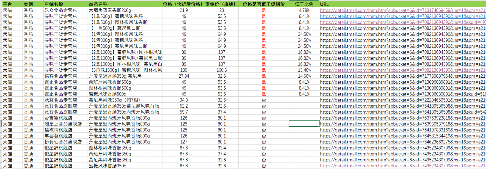
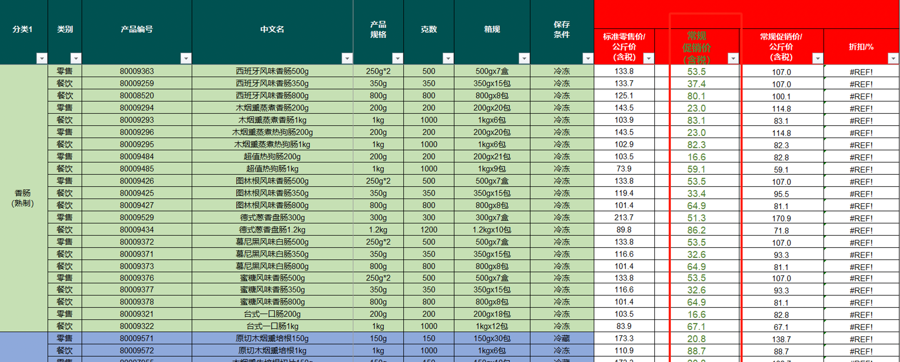

# E-commerce Price Scraper

This project consists of a multifunctional tool designed to scrape the prices of a set of products from different vendors via e-commerce websites such as Taobao, Tmall, and Jingdong.
The primary function is to compare the scraped prices and identify discounted offers to assist users in finding the best deals for their desired products.

## Example

We have a list of products, for instance: `"Danish Crown Ham Slices 800g"`, `"Danish Crown Barbecue Pork 500g"`, `"Danish Crown Sauce Pork Ribs 200g"`.
These keywords are used to search the e-commerce websites.

The goal is to generate a CSV file that contains the URL of the vendor, the price, and a boolean indicating whether the price is lower than the market price. 



The market price is given as a CSV file sourced from the official vendor of the products, for instance, Danish Crown.



## Installing and run

A step by step series of examples that tell you how to get a development environment running:

1. Clone the repo
```sh
git https://github.com/davide97l/merchants_price_scraper
```

2. Install Python packages
```sh
pip install -r requirements.txt
```

3. Run
```sh
python main.py --platforms jd taobao tmall
```

## Support this project

If you found this project interesting please support me by giving it a ⭐, I would really appreciate it 😀